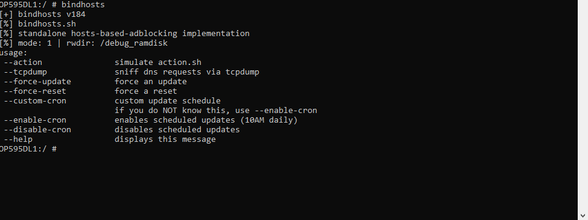

# Usage

## Usage via Terminal


In order to access the various options as shown in the image for bindhosts magisk/KSU/Apatch, you must first have su access via command line either through termux (or other various common terminal apps) or adb shell and type: bindhosts followed by the option you want.

EXAMPLE: 
```
    bindhosts --action          This will simulate bindhosts action to grab ips or reset the hosts file, depending on which state bindhosts is in
    bindhosts --tcpdump         Will sniff current active ip addresses on your network mode (wifi or data, make sure no DNS services are being used like cloudflare, etc.)
    bindhosts --query <URL>     Check hosts file for pattern
    bindhosts --force-reset     Will force reset bindhosts, which means resets the hosts file to zero ips
    bindhosts --custom-cron     Defines time of day to run a cronjob for bindhosts
    bindhosts --enable-cron     Enables cronjob task for bindhosts to update the ips of the lists you are currently using at 10am (default time)
    bindhosts --disable-cron    Disables & deletes previously set cronjob task for bindhosts
    bindhosts --help            This will show everything as shown above in image and text
```

## action
 press action to toggle update and reset
 
 

## webui
  add your custom rules, sources, whitelist or blacklist
 
 

